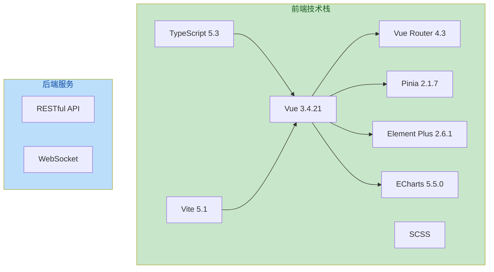

# 智互药研PC端 - 技术文档

## 目录

1. [项目概述](#1-项目概述)
2. [技术架构](#2-技术架构)
3. [项目结构](#3-项目结构)
4. [核心模块详解](#4-核心模块详解)
5. [路由系统](#5-路由系统)
6. [状态管理](#6-状态管理)
7. [类型定义](#7-类型定义)
8. [API接口文档](#8-api接口文档)
9. [组件库](#9-组件库)
10. [样式系统](#10-样式系统)
11. [工具函数](#11-工具函数)
12. [页面视图](#12-页面视图)
13. [环境变量配置](#13-环境变量配置)
14. [部署指南](#14-部署指南)
15. [开发指南](#15-开发指南)
16. [安全指南](#16-安全指南)
17. [常见问题](#17-常见问题)

---

## 1. 项目概述

### 1.1 项目简介

智互药研PC端是基于Vue 3构建的AI药物发现平台Web界面，专注于药物靶点相互作用预测、分子可视化和药物研发数据管理。

### 1.2 核心功能

| 功能模块 | 描述 |
|---------|------|
| PPI预测 | 蛋白质-蛋白质相互作用预测 |
| DTI预测 | 药物-靶点相互作用预测 |
| DDI预测 | 药物-药物相互作用预测 |
| 3D可视化 | 分子结构交互式3D展示 |
| 任务管理 | 预测任务创建、追踪与管理 |
| 结果管理 | 预测结果查看、筛选与导出 |
| 个人中心 | 用户信息管理与偏好设置 |

### 1.3 技术指标

| 指标 | 数值 |
|------|------|
| TypeScript覆盖率 | 100% |
| 路由页面数 | 10个 |
| 公共组件数 | 2个 |
| 状态管理模块 | 1个 |
| 工具函数数 | 4个 |

---

## 2. 技术架构

### 2.1 技术栈



### 2.2 架构分层

```
┌─────────────────────────────────────┐
│           视图层 (Views)            │  页面级组件
├─────────────────────────────────────┤
│          组件层 (Components)         │  可复用组件
├─────────────────────────────────────┤
│          状态层 (Stores)             │  Pinia状态管理
├─────────────────────────────────────┤
│           路由层 (Router)            │  路由与导航
├─────────────────────────────────────┤
│          工具层 (Utils)              │  业务工具函数
├─────────────────────────────────────┤
│          类型层 (Types)              │  TypeScript定义
└─────────────────────────────────────┘
```

---

## 3. 项目结构

```
d:\智互药研—PC端\
├── src/                          # 源代码目录
│   ├── components/               # 公共组件
│   │   ├── ResultCard.vue       # 结果卡片组件
│   │   └── Sidebar.vue          # 侧边栏组件
│   ├── views/                    # 页面视图
│   │   ├── Home.vue             # 首页
│   │   ├── Login.vue            # 登录页
│   │   ├── Register.vue         # 注册页
│   │   ├── Dashboard.vue        # 仪表盘
│   │   ├── Predict.vue           # 预测中心
│   │   ├── Results.vue          # 结果管理
│   │   ├── Tasks.vue            # 任务管理
│   │   ├── Targets.vue          # 靶点库
│   │   ├── Visualization.vue    # 3D可视化
│   │   └── Profile.vue          # 个人中心
│   ├── router/                   # 路由配置
│   │   └── index.ts
│   ├── stores/                   # 状态管理
│   │   └── auth.ts
│   ├── types/                    # 类型定义
│   │   └── index.ts
│   ├── data/                     # Mock数据
│   │   └── mockResults.ts
│   ├── utils/                    # 工具函数
│   │   └── validators.ts
│   ├── styles/                   # 全局样式
│   │   └── variables.scss
│   ├── App.vue                   # 根组件
│   └── main.ts                   # 入口文件
├── public/                       # 静态资源
├── dist/                         # 构建输出
├── .env.example                  # 环境变量模板
├── .gitignore                    # Git忽略配置
├── LICENSE                       # 许可证
├── package.json                  # 依赖配置
├── tsconfig.json                 # TypeScript配置
├── vite.config.ts                # Vite配置
└── README.md                     # 项目说明
```

---

## 4. 核心模块详解

### 4.1 main.ts - 应用入口

```typescript
// 位置: src/main.ts
import { createApp } from 'vue'
import { createPinia } from 'pinia'
import ElementPlus from 'element-plus'
import 'element-plus/dist/index.css'
import App from './App.vue'
import router from './router'

const app = createApp(App)
const pinia = createPinia()

app.use(pinia)      // 注册Pinia状态管理
app.use(router)     // 注册路由
app.use(ElementPlus) // 注册Element Plus UI库

app.mount('#app')
```

### 4.2 App.vue - 根组件

```typescript
// 位置: src/App.vue
// 功能:
// - 应用容器布局
// - 全局路由视图渲染
// - 页面切换过渡动画
// - AuthStore初始化
```

**关键特性:**
- 使用`<router-view>`渲染路由组件
- 配置了fade过渡动画
- 在`onMounted`中调用`authStore.init()`初始化认证状态

---

## 5. 路由系统

### 5.1 路由配置

```typescript
// 位置: src/router/index.ts
const routes = [
  { path: '/', name: 'Home', component: Home, meta: { requiresAuth: false } },
  { path: '/login', name: 'Login', component: Login, meta: { requiresAuth: false } },
  { path: '/register', name: 'Register', component: Register, meta: { requiresAuth: false } },
  { path: '/dashboard', name: 'Dashboard', component: Dashboard, meta: { requiresAuth: true } },
  { path: '/predict', name: 'Predict', component: Predict, meta: { requiresAuth: true } },
  { path: '/results', name: 'Results', component: Results, meta: { requiresAuth: true } },
  { path: '/tasks', name: 'Tasks', component: Tasks, meta: { requiresAuth: true } },
  { path: '/targets', name: 'Targets', component: Targets, meta: { requiresAuth: true } },
  { path: '/visualization', name: 'Visualization', component: Visualization, meta: { requiresAuth: true } },
  { path: '/profile', name: 'Profile', component: Profile, meta: { requiresAuth: true } },
]
```

### 5.2 路由守卫

```typescript
// 位置: src/router/index.ts:59-70
router.beforeEach((to, _from, next) => {
  const authStore = useAuthStore()

  if (to.meta.requiresAuth && !authStore.isLoggedIn) {
    next('/login')  // 未登录，重定向到登录页
  } else if (to.path === '/login' && authStore.isLoggedIn) {
    next('/dashboard')  // 已登录， 重定向到仪表盘
  } else {
    next()
  }
})
```

### 5.3 页面分类

| 页面类型 | 路由 | 访问控制 |
|---------|------|---------|
| 公开页面 | /, /login, /register | 无需认证 |
| 受保护页面 | /dashboard, /predict, /results, /tasks, /targets, /visualization, /profile | 需要登录 |

---

## 6. 状态管理

### 6.1 AuthStore - 认证状态管理

```typescript
// 位置: src/stores/auth.ts
export const useAuthStore = defineStore('auth', {
  state: () => ({
    user: null as User | null,      // 当前用户信息
    token: null as string | null,   // 认证令牌
    isLoggedIn: false,              // 登录状态
    isGuest: false                  // 游客状态
  }),

  getters: {
    currentUser: (state) => state.user,
    isAuthenticated: (state) => state.isLoggedIn,
    userNickname: (state) => state.user?.nickname || '未登录',
    isGuestUser: (state) => state.isGuest
  },

  actions: {
    init(),           // 初始化，从localStorage恢复状态
    login(),          // 用户登录
    register(),       // 用户注册
    setGuestUser(),   // 设置游客用户
    logout(),         // 用户登出
    updateNickname()  // 更新昵称
  }
})
```

### 6.2 Storage Key 配置

```typescript
const STORAGE_KEY = {
  USER: 'auth_user',      // 用户信息存储键
  TOKEN: 'auth_token',    // 认证令牌存储键
  IS_GUEST: 'auth_is_guest'  // 游客状态存储键
}
```

### 6.3 状态持久化

```typescript
// 状态通过localStorage持久化
// 初始化时从localStorage恢复
// 登录/登出时更新localStorage
```

---

## 7. 类型定义

### 7.1 核心类型

```typescript
// 位置: src/types/index.ts

// 用户信息
interface User {
  id: string
  email: string
  nickname: string
  avatar?: string
  createdAt: string
}

// 预测目标
interface Target {
  id: string
  name: string
  uniprotId: string
  pdbId: string
  description: string
  status: 'supported' | 'beta' | 'planned'
  geneName?: string
  organism?: string
  pdbIds?: string[]
}

// 输入数据类型
interface InputData {
  type: 'pdb' | 'uniprot' | 'smiles' | 'csv'
  value: string
  fileName?: string
}

// 预测结果
interface PredictionResult {
  id: string
  targetId: string
  targetName: string
  ligandSmiles: string
  bindingAffinity: number
  confidenceScore: number
  confidenceLevel: 'high' | 'medium' | 'low'
  interactions: Interaction[]
  createdAt: string
  datasetInfo: DatasetInfo
}

// 相互作用
interface Interaction {
  type: 'hydrogen_bond' | 'hydrophobic' | 'ionic' | 'pi_pi' | 'metal'
  residueName: string
  residueNumber: number
  distance: number
}

// 任务
interface Task {
  id: string
  name?: string
  type: 'prediction' | 'validation' | 'batch_screening'
  status: 'pending' | 'running' | 'completed' | 'failed'
  progress: number
  input: InputData
  resultId?: string
  createdAt: string
  updatedAt: string
}

// 验证结果
interface ValidationResult {
  inputType: string
  inputValue: string
  isValid: boolean
  message: string
  suggestions?: string[]
}
```

### 7.2 认证相关类型

```typescript
// 登录凭据
interface LoginCredentials {
  email: string
  password: string
}

// 注册数据
interface RegisterData {
  email: string
  password: string
  confirmPassword: string
  nickname: string
}

// 认证状态
interface AuthState {
  user: User | null
  isLoggedIn: boolean
  token: string | null
}

// 登录结果
interface LoginResult {
  success: boolean
  message: string
  user?: User
  token?: string
}

// 注册结果
interface RegisterResult {
  success: boolean
  message: string
  user?: User
}
```

---

## 8. API接口文档

### 8.1 当前接口（Mock模式）

> **注意**: 当前版本使用Mock数据进行开发，正式环境需对接真实API

#### 认证接口

| 接口 | 方法 | 描述 | 参数 |
|------|------|------|------|
| /auth/login | POST | 用户登录 | { email, password } |
| /auth/register | POST | 用户注册 | { email, password, nickname } |
| /auth/logout | POST | 用户登出 | - |
| /auth/guest | POST | 游客登录 | - |

#### 预测接口

| 接口 | 方法 | 描述 | 参数 |
|------|------|------|------|
| /predict/ppi | POST | PPI预测 | { inputType, value } |
| /predict/dti | POST | DTI预测 | { inputType, value } |
| /predict/ddi | POST | DDI预测 | { inputType, value } |

#### 结果接口

| 接口 | 方法 | 描述 | 参数 |
|------|------|------|------|
| /results | GET | 获取结果列表 | { page, limit, filters } |
| /results/:id | GET | 获取结果详情 | { id } |
| /results/:id/export | POST | 导出结果 | { id, format } |

#### 任务接口

| 接口 | 方法 | 描述 | 参数 |
|------|------|------|------|
| /tasks | GET | 获取任务列表 | { status, page } |
| /tasks | POST | 创建任务 | { type, input } |
| /tasks/:id | GET | 获取任务详情 | { id } |
| /tasks/:id/cancel | POST | 取消任务 | { id } |

### 8.2 预测输入格式

```typescript
// PDB ID格式
{ type: 'pdb', value: '6M0J' }

// UniProt ID格式
{ type: 'uniprot', value: 'P01234' }

// SMILES格式
{ type: 'smiles', value: 'CC(=O)OC1=CC=CC=C1C(=O)O' }

// CSV文件格式
{ type: 'csv', value: 'compounds.csv', fileName: 'compounds.csv' }
```

### 8.3 预测输出格式

```typescript
{
  id: 'result_001',
  targetId: 'P01234',
  targetName: 'ACE2',
  ligandSmiles: 'C(=O)(C(=O)O)NC(CCC(=O)O)C(=O)O',
  bindingAffinity: -9.2,  // kcal/mol
  confidenceScore: 0.92,  // 0-1
  confidenceLevel: 'high', // high | medium | low
  interactions: [
    { type: 'hydrogen_bond', residueName: 'ASP', residueNumber: 30, distance: 2.8 }
  ],
  createdAt: '2024-01-01T00:00:00Z',
  datasetInfo: {
    name: 'DrugBank精选数据集',
    size: 12500,
    description: '包含FDA批准药物及其靶点相互作用数据',
    source: 'internal'
  }
}
```

---

## 9. 组件库

### 9.1 ResultCard - 结果卡片组件

```vue
<!-- 位置: src/components/ResultCard.vue -->
<template>
  <div class="result-card">
    <!-- 头部：靶点信息 + 置信度标签 -->
    <div class="result-card__header">
      <div class="result-card__target">
        <span class="result-card__target-name">{{ result.targetName }}</span>
        <span class="result-card__target-id">{{ result.targetId }}</span>
      </div>
      <span class="result-card__confidence" :class="`result-card__confidence--${result.confidenceLevel}`">
        {{ getConfidenceText(result.confidenceLevel) }}
      </span>
    </div>

    <!-- 主体：亲和力 + 置信度条 -->
    <div class="result-card__main">
      <div class="result-card__affinity">...</div>
      <div class="result-card__confidence-section">...</div>
    </div>

    <!-- 相互作用标签 -->
    <div class="result-card__interactions">...</div>

    <!-- 底部：日期 + 操作按钮 -->
    <div class="result-card__footer">...</div>
  </div>
</template>
```

**Props:**
| 属性 | 类型 | 必填 | 描述 |
|------|------|------|------|
| result | PredictionResult | 是 | 预测结果数据 |

**Events:**
| 事件名 | 参数 | 描述 |
|--------|------|------|
| detail | PredictionResult | 点击详情按钮 |
| 3d | PredictionResult | 点击3D按钮 |

### 9.2 Sidebar - 侧边栏组件

```vue
<!-- 位置: src/components/Sidebar.vue -->
<template>
  <aside class="sidebar">
    <!-- 品牌区域 -->
    <div class="sidebar__brand">
      <div class="sidebar__logo">
        <span class="sidebar__logo-icon">🧬</span>
        <span class="sidebar__logo-text">智互药研</span>
      </div>
    </div>

    <!-- 导航菜单 -->
    <nav class="sidebar__nav">
      <router-link
        v-for="item in navItems"
        :key="item.path"
        :to="item.path"
        class="sidebar__nav-item"
      >
        <span class="sidebar__nav-icon">{{ item.icon }}</span>
        <span class="sidebar__nav-text">{{ item.label }}</span>
        <span v-if="item.badge" class="sidebar__nav-badge">{{ item.badge }}</span>
      </router-link>
    </nav>

    <!-- 用户信息 -->
    <div class="sidebar__user">
      <div class="sidebar__user-avatar">{{ avatarText }}</div>
      <div class="sidebar__user-info">
        <span class="sidebar__user-name">{{ authStore.userNickname }}</span>
        <span class="sidebar__user-role">{{ authStore.isGuest ? '游客' : '用户' }}</span>
      </div>
      <button class="sidebar__logout-btn" @click="handleLogout">退出</button>
    </div>
  </aside>
</template>
```

**导航配置:**
```typescript
const navItems = [
  { path: '/dashboard', label: '仪表盘', icon: '📊' },
  { path: '/predict', label: '预测中心', icon: '🎯' },
  { path: '/results', label: '预测结果', icon: '📈' },
  { path: '/tasks', label: '任务管理', icon: '📋', badge: '2' },
  { path: '/targets', label: '靶点库', icon: '🧪' },
  { path: '/visualization', label: '3D可视化', icon: '3D' },
  { path: '/profile', label: '个人中心', icon: '👤' }
]
```

---

## 10. 样式系统

### 10.1 样式变量

```scss
// 位置: src/styles/variables.scss

// 主色调
$primary-color: #1e293b;
$primary-light: #334155;
$primary-dark: #0f172a;

// 强调色
$accent-color: #3b82f6;
$accent-light: #60a5fa;

// 状态色
$success-color: #10b981;
$warning-color: #f59e0b;
$error-color: #ef4444;
$info-color: #06b6d4;

// 文字色
$text-primary: #0f172a;
$text-secondary: #475569;
$text-muted: #94a3b8;
$text-light: #cbd5e1;

// 背景色
$bg-primary: #ffffff;
$bg-secondary: #f8fafc;
$bg-tertiary: #f1f5f9;
$bg-sidebar: #0f172a;

// 边框
$border-color: #e2e8f0;
$border-light: #f1f5f9;

// 阴影
$shadow-sm: 0 1px 2px rgba(0, 0, 0, 0.04);
$shadow-md: 0 4px 6px rgba(0, 0, 0, 0.04);
$shadow-lg: 0 10px 15px rgba(0, 0, 0, 0.06);

// 圆角
$border-radius-sm: 6px;
$border-radius-md: 10px;
$border-radius-lg: 16px;
$border-radius-xl: 20px;

// 间距
$spacing-xs: 4px;
$spacing-sm: 8px;
$spacing-md: 16px;
$spacing-lg: 24px;
$spacing-xl: 32px;
$spacing-2xl: 48px;

// 字体大小
$font-size-xs: 11px;
$font-size-sm: 13px;
$font-size-base: 14px;
$font-size-lg: 16px;
$font-size-xl: 20px;
$font-size-2xl: 26px;
$font-size-3xl: 32px;

// 过渡
$transition-fast: 0.15s ease;
$transition-normal: 0.25s ease;
$transition-slow: 0.4s ease;

// 布局
$sidebar-width: 220px;
$header-height: 60px;
```

### 10.2 全局样式

```scss
// 位置: src/App.vue (style部分)

// 滚动条样式
::-webkit-scrollbar {
  width: 6px;
  height: 6px;
}

::-webkit-scrollbar-track {
  background: transparent;
}

::-webkit-scrollbar-thumb {
  background: $border-color;
  border-radius: 3px;
}

::-webkit-scrollbar-thumb:hover {
  background: $text-muted;
}

// CSS Reset
* {
  margin: 0;
  padding: 0;
  box-sizing: border-box;
}

html, body {
  height: 100%;
  font-size: $font-size-base;
  color: $text-primary;
  background: $bg-secondary;
}
```

---

## 11. 工具函数

### 11.1 表单验证器

```typescript
// 位置: src/utils/validators.ts

// PDB ID验证
export const validatePdbId = (value: string): ValidationResult => {
  // 格式: 4个字符，首位为数字，如1ABC
  const pdbPattern = /^[1-9][A-Za-z0-9]{3}$/
  // ...
}

// UniProt ID验证
export const validateUniProtId = (value: string): ValidationResult => {
  // 格式: 6个字符，首位为字母，如P01234
  const uniprotPattern = /^[A-Z][A-Z0-9]{5}$/
  // ...
}

// SMILES验证
export const validateSmiles = (value: string): ValidationResult => {
  // 格式: 有效的SMILES字符串
  const smilesPattern = /^[A-Za-z0-9@+\-\[\]()=#$.%&\/\\~`'"]+$/
  // 长度限制: 1000字符
  // ...
}

// CSV文件验证
export const validateCsvFile = (fileName: string): ValidationResult => {
  // 验证文件扩展名为.csv
  // ...
}
```

### 11.2 验证规则

| 输入类型 | 格式要求 | 长度限制 | 错误提示 |
|---------|---------|---------|---------|
| PDB ID | 4字符，首位数字 | - | 格式应为4个字符，如1ABC |
| UniProt ID | 6字符，首位字母 | - | 格式应为6个字符，以字母开头 |
| SMILES | 有效SMILES字符 | ≤1000 | 请输入有效的SMILES分子表示 |
| CSV | .csv扩展名 | - | 请选择CSV格式文件 |

---

## 12. 页面视图

### 12.1 页面概览

| 页面 | 路由 | 描述 | 访问控制 |
|------|------|------|---------|
| 首页 | / | 产品介绍与导航 | 公开 |
| 登录 | /login | 用户登录 | 公开 |
| 注册 | /register | 用户注册 | 公开 |
| 仪表盘 | /dashboard | 数据统计与概览 | 需要登录 |
| 预测中心 | /predict | 创建预测任务 | 需要登录 |
| 预测结果 | /results | 查看历史结果 | 需要登录 |
| 任务管理 | /tasks | 管理预测任务 | 需要登录 |
| 靶点库 | /targets | 浏览靶点信息 | 需要登录 |
| 3D可视化 | /visualization | 分子3D展示 | 需要登录 |
| 个人中心 | /profile | 用户设置 | 需要登录 |

### 12.2 首页 (Home.vue)

**功能:**
- 产品Logo与导航
- 核心功能介绍（PPI/DTI/DDI预测）
- 技术架构展示
- 在线演示入口
- 注册/登录入口

**关键组件:**
- `HomeHero`: 英雄区域，SVG分子图动画
- `FeatureCard`: 功能卡片网格布局
- `ArchitectureDiagram`: 技术架构图

### 12.3 登录页 (Login.vue)

**功能:**
- 邮箱/密码登录
- 记住我选项
- 游客模式入口
- 注册链接

**表单验证:**
- 邮箱格式验证
- 密码非空验证

### 12.4 仪表盘 (Dashboard.vue)

**功能:**
- 用户欢迎信息
- 任务统计卡片（总数/完成/运行中）
- 平均置信度展示
- 最近任务列表
- 最近结果卡片

**数据来源:**
- `mockTasks`: 任务Mock数据
- `mockResults`: 结果Mock数据

### 12.5 预测中心 (Predict.vue)

**功能:**
- 预测类型选择（PPI/DTI/DDI）
- 输入类型选择（PDB/UniProt/SMILES/CSV）
- 高级选项配置
- 演示数据预测
- 结果展示

**预测流程:**
```
选择预测类型 → 选择输入格式 → 输入数据 → 配置选项 → 开始预测 → 查看结果
```

### 12.6 结果管理 (Results.vue)

**功能:**
- 结果搜索
- 置信度筛选
- 排序选项
- 结果卡片列表
- 分页支持

**筛选条件:**
- 置信度等级（高/中/低）
- 搜索关键词
- 排序方式（日期/亲和力/置信度）

### 12.7 任务管理 (Tasks.vue)

**功能:**
- 任务状态Tab（全部/运行中/待处理/已完成/失败）
- 任务卡片展示
- 进度条显示
- 任务操作（暂停/查看/删除）

**任务状态:**
```typescript
type TaskStatus = 'pending' | 'running' | 'completed' | 'failed'
```

### 12.8 靶点库 (Targets.vue)

**功能:**
- 靶点列表展示
- 靶点详情信息
- 状态标签（supported/beta/planned）
- PDB ID与UniProt ID展示

### 12.9 3D可视化 (Visualization.vue)

**功能:**
- 分子3D结构渲染
- 交互控制（旋转/缩放/平移）
- 相互作用标注
- 视图切换

**技术实现:**
- 使用ECharts GL或Three.js
- 支持PDB/mmCIF格式

### 12.10 个人中心 (Profile.vue)

**功能:**
- 用户信息展示
- 头像与昵称编辑
- 账户安全设置
- 使用统计
- 系统设置（深色模式/通知）
- 退出登录

---

## 13. 环境变量配置

### 13.1 环境变量模板

```bash
# 位置: .env.example

# 应用配置
VITE_APP_TITLE=智互药研
VITE_APP_VERSION=1.0.0

# API配置
VITE_API_BASE_URL=http://localhost:3000
VITE_API_TIMEOUT=30000

# Mock模式
VITE_ENABLE_MOCK=true
VITE_MOCK_DELAY=800

# 功能开关
VITE_ENABLE_ANALYTICS=false
VITE_ENABLE_ERROR_REPORTING=false

# 开发配置
VITE_DEV_PORT=5174
VITE_DEV_HOST=0.0.0.0
```

### 13.2 环境变量使用

```typescript
// 在代码中访问环境变量
const appTitle = import.meta.env.VITE_APP_TITLE
const apiBaseUrl = import.meta.env.VITE_API_BASE_URL
const isMockEnabled = import.meta.env.VITE_ENABLE_MOCK === 'true'
```

### 13.3 环境说明

| 环境 | 文件 | 用途 |
|------|------|------|
| 开发环境 | .env.development | 本地开发 |
| 生产环境 | .env.production | 生产部署 |
| 本地覆盖 | .env.local | 本地特殊配置（不提交） |
| 示例模板 | .env.example | 变量说明模板 |

---

## 14. 部署指南

### 14.1 构建命令

```bash
# 安装依赖
npm install

# 开发模式
npm run dev

# 类型检查
npm run typecheck

# 生产构建
npm run build

# 预览构建
npm run preview
```

### 14.2 构建输出

```
dist/
├── index.html
└── assets/
    ├── Dashboard-BsEiLUWa.css
    ├── Dashboard-maBEgkXZ.js
    ├── Home-C4NXM9U_.css
    └── ...
```

### 14.3 部署配置

#### Nginx配置示例

```nginx
server {
    listen 80;
    server_name your-domain.com;

    root /path/to/dist;
    index index.html;

    # SPA路由支持
    location / {
        try_files $uri $uri/ /index.html;
    }

    # 静态资源缓存
    location /assets/ {
        expires 1y;
        add_header Cache-Control "public, immutable";
    }

    # API代理（可选）
    location /api/ {
        proxy_pass http://backend-server:3000/;
    }
}
```

#### Vercel配置

```json
// vercel.json
{
  "rewrites": [
    { "source": "/(.*)", "destination": "/index.html" }
  ]
}
```

### 14.4 Docker部署

```dockerfile
# Dockerfile
FROM nginx:alpine
COPY dist/ /usr/share/nginx/html/
COPY nginx.conf /etc/nginx/conf.d/default.conf
EXPOSE 80
CMD ["nginx", "-g", "daemon off;"]
```

---

## 15. 开发指南

### 15.1 项目初始化

```bash
# 克隆仓库
git clone <repository-url>
cd 智互药研—PC端

# 安装依赖
npm install

# 复制环境变量
cp .env.example .env.local

# 启动开发服务器
npm run dev
```

### 15.2 开发规范

#### 组件命名
- 组件文件使用PascalCase: `ResultCard.vue`
- 组件名使用PascalCase: `ResultCard`
- 组件class使用BEM: `result-card__header`

#### TypeScript规范
- 所有组件使用`<script setup lang="ts">`
- 显式声明props类型
- 使用interface定义数据结构

#### 样式规范
- 使用SCSS预处理器
- 通过variables.scss管理全局变量
- 组件样式使用scoped
- 使用BEM命名规范

### 15.3 调试技巧

```typescript
// 临时调试：添加console.log
console.log('Debug:', value)

// Vue DevTools
// 安装Vue DevTools浏览器扩展
// https://devtools.vuejs.org/
```

### 15.4 测试建议

```bash
# 单元测试（推荐添加）
npm run test:unit

# E2E测试（推荐添加）
npm run test:e2e
```

---

## 16. 安全指南

### 16.1 当前安全考虑

#### 认证状态存储

> **⚠️ 警告**: 当前版本使用localStorage存储认证token，存在XSS攻击风险

**当前实现:**
```typescript
localStorage.setItem('auth_token', token)
```

**建议改进:**
```typescript
// 方案1: 使用HttpOnly Cookie
// 方案2: 使用加密存储
import CryptoJS from 'crypto-js'
const encrypted = CryptoJS.AES.encrypt(token, secretKey)
localStorage.setItem('auth_token_encrypted', encrypted.toString())
```

### 16.2 输入验证

所有用户输入必须经过验证：

```typescript
import { validatePdbId, validateUniProtId, validateSmiles } from '@/utils/validators'

// 在组件中使用
const validation = validatePdbId(inputValue)
if (!validation.isValid) {
  showError(validation.message)
}
```

### 16.3 API安全

**生产环境建议:**
- 所有API使用HTTPS
- 实现CSRF防护
- 添加请求频率限制
- 使用JWT并设置过期时间

### 16.4 敏感信息处理

```bash
# .env.local (不应提交到Git)
VITE_API_SECRET=your-secret-key

# .gitignore 已包含
.env.local
```

---

## 17. 常见问题

### Q1: 项目启动报错"Cannot find module"

**解决方案:**
```bash
# 清除node_modules并重新安装
rm -rf node_modules package-lock.json
npm install
```

### Q2: TypeScript类型错误

**解决方案:**
```bash
# 运行类型检查
npm run typecheck

# 更新类型定义
npx vue-tsc --noEmit
```

### Q3: Mock数据不生效

**检查:**
1. `VITE_ENABLE_MOCK=true` 在.env.local中
2. `mockResults.ts` 数据格式正确
3. 组件正确导入了mock数据

### Q4: 样式变量未生效

**检查:**
1. `vite.config.ts` 中SCSS配置正确
```typescript
css: {
  preprocessorOptions: {
    scss: {
      additionalData: `@import "@/styles/variables.scss";`
    }
  }
}
```

### Q5: 路由跳转404

**Nginx配置:**
```nginx
location / {
  try_files $uri $uri/ /index.html;
}
```

---

## 附录

### A. 依赖版本

| 依赖 | 版本 | 用途 |
|------|------|------|
| vue | ^3.4.21 | 核心框架 |
| vue-router | ^4.3.0 | 路由管理 |
| pinia | ^2.1.7 | 状态管理 |
| element-plus | ^2.6.1 | UI组件库 |
| echarts | ^5.5.0 | 图表库 |
| typescript | ^5.3.3 | 类型系统 |
| vite | ^5.1.0 | 构建工具 |
| sass | ^1.70.0 | 样式预处理器 |

### B. 浏览器支持

| 浏览器 | 最低版本 |
|--------|---------|
| Chrome | 90+ |
| Firefox | 88+ |
| Safari | 14+ |
| Edge | 90+ |

### C. 相关资源

- [Vue 3文档](https://vuejs.org/)
- [TypeScript文档](https://www.typescriptlang.org/)
- [Element Plus文档](https://element-plus.org/)
- [Pinia文档](https://pinia.vuejs.org/)
- [Vite文档](https://vitejs.dev/)

---

**文档版本**: 1.0.0
**最后更新**: 2024年
**维护者**: 智互药研团队
