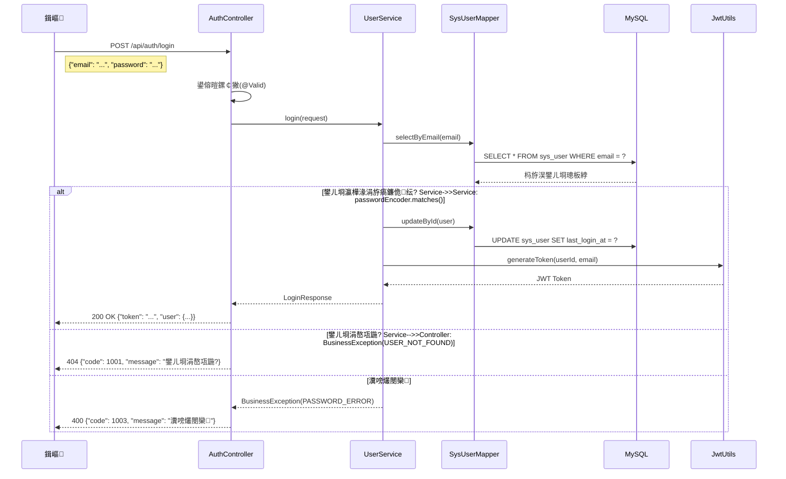
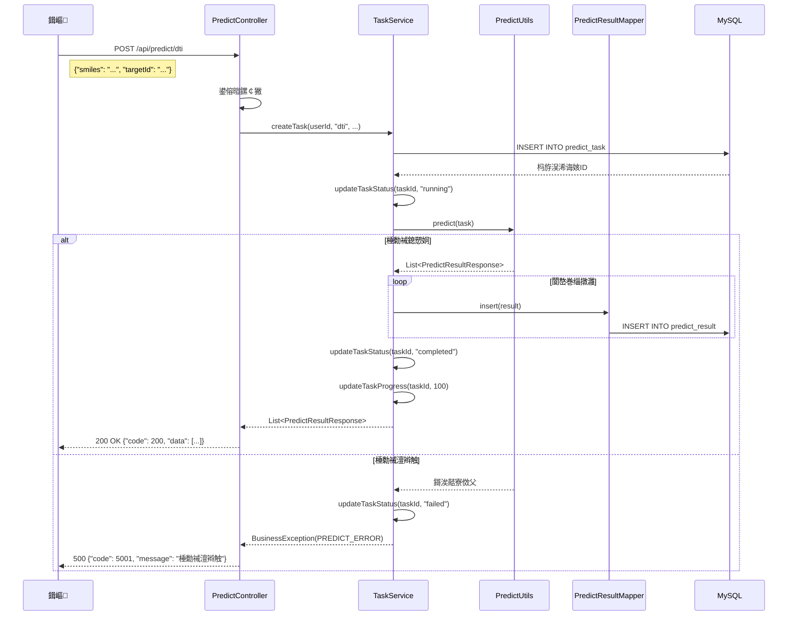

# SynPharm AI鑽墿鍙戠幇骞冲彴 - 鍚庣鎶€鏈璁℃枃妗?
## 1. 椤圭洰姒傝堪

### 1.1 椤圭洰鑳屾櫙
SynPharm鏄竴涓熀浜嶢I鐨勮嵂鐗╁彂鐜板钩鍙帮紝涓撴敞浜庤嵂鐗?闈剁偣鐩镐簰浣滅敤锛圖TI锛夈€佽泲鐧借川-铔嬬櫧璐ㄧ浉浜掍綔鐢紙PPI锛夊拰鑽墿-鑽墿鐩镐簰浣滅敤锛圖DI锛夌殑棰勬祴鍒嗘瀽銆?
### 1.2 鏍稿績鍔熻兘
| 鍔熻兘妯″潡 | 鍔熻兘鎻忚堪 |
| :--- | :--- |
| 鐢ㄦ埛璁よ瘉 | 鐢ㄦ埛娉ㄥ唽銆佺櫥褰曘€丣WT浠ょ墝绠＄悊 |
| DTI棰勬祴 | 鑽墿-闈剁偣鐩镐簰浣滅敤棰勬祴 |
| PPI棰勬祴 | 铔嬬櫧璐?铔嬬櫧璐ㄧ浉浜掍綔鐢ㄩ娴?|
| DDI棰勬祴 | 鑽墿-鑽墿鐩镐簰浣滅敤棰勬祴 |
| 浠诲姟绠＄悊 | 棰勬祴浠诲姟鐨勫垱寤恒€佹煡璇€佺姸鎬佽窡韪?|

---

## 2. 鎶€鏈爤

| 鍒嗙被 | 鎶€鏈?| 鐗堟湰 | 璇存槑 |
| :--- | :--- | :--- | :--- |
| 璇█ | Java | 21 | LTS鐗堟湰锛屾€ц兘绋冲畾 |
| 妗嗘灦 | Spring Boot | 3.2.x | 绀惧尯鎴愮啛锛岀敓鎬佸畬鍠?|
| 鏁版嵁搴?| MySQL | 8.0+ | 鍏崇郴鍨嬫暟鎹簱锛岀ǔ瀹氬彲闈?|
| ORM | MyBatis Plus | 3.5.x | 绠€鍖朇RUD鎿嶄綔 |
| 璁よ瘉 | JWT | - | 鏃犵姸鎬佽韩浠借璇?|
| 瀹夊叏 | Spring Security | 6.2.x | 鏉冮檺鎺у埗 |
| 鏂囨。 | Knife4j | 4.4.x | API鏂囨。鐢熸垚 |
| JSON | Jackson | - | JSON搴忓垪鍖?|

---

## 3. 鏋舵瀯璁捐

### 3.1 鏋舵瀯椋庢牸
閲囩敤**鍒嗗眰鍗曚綋搴旂敤**锛圠ayered Monolith锛夋灦鏋勶紝閬靛惊缁忓吀鐨凪VC妯″紡锛?
```mermaid
graph TB
    subgraph 瀹㈡埛绔眰
        A[鍓嶇Web]
        B[灏忕▼搴廬
        C[绉诲姩绔痌
    end
    
    subgraph 鎺у埗灞?        D[AuthController]
        E[PredictController]
    end
    
    subgraph 涓氬姟灞?        F[UserService]
        G[TaskService]
    end
    
    subgraph 鏁版嵁璁块棶灞?        H[SysUserMapper]
        I[PredictTaskMapper]
        J[PredictResultMapper]
    end
    
    subgraph 鏁版嵁灞?        K[(MySQL鏁版嵁搴?]
    end
    
    A --> D
    A --> E
    B --> D
    B --> E
    C --> D
    C --> E
    
    D --> F
    E --> G
    
    F --> H
    G --> I
    G --> J
    
    H --> K
    I --> K
    J --> K
```

### 3.2 妯″潡鍒掑垎

| 妯″潡 | 鍖呰矾寰?| 鑱岃矗璇存槑 |
| :--- | :--- | :--- |
| controller | `com.synpharm.controller` | 澶勭悊HTTP璇锋眰锛屽弬鏁版牎楠岋紝璋冪敤Service |
| service | `com.synpharm.service` | 涓氬姟閫昏緫澶勭悊锛屼簨鍔＄鐞?|
| repository | `com.synpharm.repository` | 鏁版嵁璁块棶锛屼笌鏁版嵁搴撲氦浜?|
| entity | `com.synpharm.model.entity` | 鏁版嵁搴撳疄浣撴槧灏?|
| dto | `com.synpharm.dto` | 鏁版嵁浼犺緭瀵硅薄锛堣姹?鍝嶅簲锛?|
| config | `com.synpharm.config` | 閰嶇疆绫伙紙瀹夊叏銆佽法鍩熴€丮yBatis绛夛級 |
| utils | `com.synpharm.utils` | 宸ュ叿绫伙紙JWT銆侀娴嬬畻娉曪級 |
| exception | `com.synpharm.exception` | 寮傚父澶勭悊锛堜笟鍔″紓甯搞€佸叏灞€寮傚父锛?|

### 3.3 鏍稿績娴佺▼鍥?
#### 鐢ㄦ埛鐧诲綍娴佺▼



#### 棰勬祴浠诲姟鎵ц娴佺▼



---

## 4. 鏁版嵁搴撹璁?
### 4.1 瀹炰綋鍏崇郴鍥?
```mermaid
erDiagram
    SYS_USER ||--o{ PREDICT_TASK : creates
    PREDICT_TASK ||--o{ PREDICT_RESULT : has
    
    SYS_USER {
        bigint id PK "鐢ㄦ埛ID"
        varchar email UK "鐢ㄦ埛閭"
        varchar password "鍔犲瘑瀵嗙爜"
        varchar nickname "鐢ㄦ埛鏄电О"
        varchar avatar_url "澶村儚URL"
        varchar role "瑙掕壊"
        tinyint status "鐘舵€?
        tinyint email_verified "閭楠岃瘉鐘舵€?
        datetime last_login_at "鏈€鍚庣櫥褰曟椂闂?
        datetime created_at "鍒涘缓鏃堕棿"
        datetime updated_at "鏇存柊鏃堕棿"
        tinyint deleted "鍒犻櫎鏍囪"
    }
    
    PREDICT_TASK {
        bigint id PK "浠诲姟ID"
        varchar task_no UK "浠诲姟缂栧彿"
        bigint user_id FK "鐢ㄦ埛ID"
        varchar predict_type "棰勬祴绫诲瀷"
        varchar input_type "杈撳叆绫诲瀷"
        text input_value "杈撳叆鍊?
        varchar file_url "鏂囦欢URL"
        varchar status "浠诲姟鐘舵€?
        int progress "浠诲姟杩涘害"
        datetime created_at "鍒涘缓鏃堕棿"
        datetime updated_at "鏇存柊鏃堕棿"
        tinyint deleted "鍒犻櫎鏍囪"
    }
    
    PREDICT_RESULT {
        bigint id PK "缁撴灉ID"
        bigint task_id FK "浠诲姟ID"
        varchar target_id "闈剁偣ID"
        varchar target_name "闈剁偣鍚嶇О"
        double binding_affinity "缁撳悎浜插拰鍔?
        double confidence_score "缃俊搴﹀垎鏁?
        varchar confidence_level "缃俊搴︾瓑绾?
        text interactions "鐩镐簰浣滅敤淇℃伅(JSON)"
        text result_data "缁撴灉鏁版嵁(JSON)"
        datetime created_at "鍒涘缓鏃堕棿"
        datetime updated_at "鏇存柊鏃堕棿"
        tinyint deleted "鍒犻櫎鏍囪"
    }
```

### 4.2 琛ㄧ粨鏋勮瑙?
#### sys_user锛堢郴缁熺敤鎴疯〃锛?
| 瀛楁鍚?| 鏁版嵁绫诲瀷 | 绾︽潫 | 璇存槑 |
| :--- | :--- | :--- | :--- |
| id | BIGINT | PRIMARY KEY, AUTO_INCREMENT | 鐢ㄦ埛鍞竴鏍囪瘑 |
| email | VARCHAR(100) | UNIQUE, NOT NULL | 鐢ㄦ埛閭锛堢櫥褰曡处鍙凤級 |
| password | VARCHAR(255) | NOT NULL | BCrypt鍔犲瘑鍚庣殑瀵嗙爜 |
| nickname | VARCHAR(50) | NOT NULL | 鐢ㄦ埛鏄电О |
| avatar_url | VARCHAR(255) | NULL | 澶村儚URL |
| role | VARCHAR(20) | DEFAULT 'user' | 瑙掕壊锛歶ser/admin/guest |
| status | TINYINT | DEFAULT 1 | 鐘舵€侊細0绂佺敤锛?鍚敤 |
| email_verified | TINYINT | DEFAULT 0 | 閭楠岃瘉锛?鏈獙璇侊紝1宸查獙璇?|
| last_login_at | DATETIME | NULL | 鏈€鍚庣櫥褰曟椂闂?|
| created_at | DATETIME | NOT NULL | 鍒涘缓鏃堕棿锛堣嚜鍔ㄥ～鍏咃級 |
| updated_at | DATETIME | NOT NULL | 鏇存柊鏃堕棿锛堣嚜鍔ㄥ～鍏咃級 |
| deleted | TINYINT | DEFAULT 0 | 閫昏緫鍒犻櫎锛?鏈垹闄わ紝1宸插垹闄?|

#### predict_task锛堥娴嬩换鍔¤〃锛?
| 瀛楁鍚?| 鏁版嵁绫诲瀷 | 绾︽潫 | 璇存槑 |
| :--- | :--- | :--- | :--- |
| id | BIGINT | PRIMARY KEY, AUTO_INCREMENT | 浠诲姟鍞竴鏍囪瘑 |
| task_no | VARCHAR(50) | UNIQUE, NOT NULL | 浠诲姟缂栧彿锛堝TASK1704067200000锛?|
| user_id | BIGINT | FOREIGN KEY | 鍏宠仈鐢ㄦ埛ID |
| predict_type | VARCHAR(20) | NOT NULL | 棰勬祴绫诲瀷锛歞ti/ppi/ddi |
| input_type | VARCHAR(20) | NOT NULL | 杈撳叆绫诲瀷锛歴miles/sequence/file |
| input_value | TEXT | NULL | 杈撳叆鍊硷紙SMILES鎴栧簭鍒楋級 |
| file_url | VARCHAR(255) | NULL | 涓婁紶鏂囦欢URL |
| status | VARCHAR(20) | DEFAULT 'pending' | 鐘舵€侊細pending/running/completed/failed/cancelled |
| progress | INT | DEFAULT 0 | 杩涘害锛?-100锛?|
| created_at | DATETIME | NOT NULL | 鍒涘缓鏃堕棿锛堣嚜鍔ㄥ～鍏咃級 |
| updated_at | DATETIME | NOT NULL | 鏇存柊鏃堕棿锛堣嚜鍔ㄥ～鍏咃級 |
| deleted | TINYINT | DEFAULT 0 | 閫昏緫鍒犻櫎鏍囪 |

#### predict_result锛堥娴嬬粨鏋滆〃锛?
| 瀛楁鍚?| 鏁版嵁绫诲瀷 | 绾︽潫 | 璇存槑 |
| :--- | :--- | :--- | :--- |
| id | BIGINT | PRIMARY KEY, AUTO_INCREMENT | 缁撴灉鍞竴鏍囪瘑 |
| task_id | BIGINT | FOREIGN KEY | 鍏宠仈浠诲姟ID |
| target_id | VARCHAR(50) | NOT NULL | 闈剁偣ID |
| target_name | VARCHAR(100) | NULL | 闈剁偣鍚嶇О |
| binding_affinity | DOUBLE | NULL | 缁撳悎浜插拰鍔涳紙璐熷€艰〃绀轰翰鍜屽姏寮猴級 |
| confidence_score | DOUBLE | NULL | 缃俊搴﹀垎鏁帮紙0-1锛?|
| confidence_level | VARCHAR(10) | NULL | 缃俊搴︾瓑绾э細楂?涓?浣?|
| interactions | TEXT | NULL | 鐩镐簰浣滅敤淇℃伅锛圝SON鏍煎紡锛?|
| result_data | TEXT | NULL | 瀹屾暣缁撴灉鏁版嵁锛圝SON鏍煎紡锛?|
| created_at | DATETIME | NOT NULL | 鍒涘缓鏃堕棿锛堣嚜鍔ㄥ～鍏咃級 |
| updated_at | DATETIME | NOT NULL | 鏇存柊鏃堕棿锛堣嚜鍔ㄥ～鍏咃級 |
| deleted | TINYINT | DEFAULT 0 | 閫昏緫鍒犻櫎鏍囪 |

---

## 5. 鏍稿績浠ｇ爜瑙ｆ瀽

### 5.1 璁よ瘉妯″潡

#### 5.1.1 JWT璁よ瘉杩囨护鍣?
```java
// 鏂囦欢: config/JwtAuthenticationFilter.java
// 鏍稿績閫昏緫锛?// 1. 浠庤姹傚ご鑾峰彇Authorization: Bearer <token>
// 2. 楠岃瘉JWT浠ょ墝鏈夋晥鎬?// 3. 浠庝护鐗屼腑鎻愬彇鐢ㄦ埛ID
// 4. 浠庢暟鎹簱鍔犺浇鐢ㄦ埛淇℃伅
// 5. 璁剧疆Spring Security涓婁笅鏂囷紙SecurityContextHolder锛?```

#### 5.1.2 鐧诲綍娴佺▼鏍稿績浠ｇ爜

```java
// 鏂囦欢: service/impl/UserServiceImpl.java
// 鐧诲綍鏂规硶鎵ц姝ラ锛?// 1. 鏍规嵁閭鏌ヨ鐢ㄦ埛
// 2. 楠岃瘉瀵嗙爜锛圔Crypt鍖归厤锛?// 3. 妫€鏌ョ敤鎴风姸鎬?// 4. 鏇存柊鏈€鍚庣櫥褰曟椂闂?// 5. 鐢熸垚JWT浠ょ墝
// 6. 杩斿洖鐧诲綍鍝嶅簲锛堜护鐗?鐢ㄦ埛淇℃伅锛?```

### 5.2 棰勬祴妯″潡

#### 5.2.1 棰勬祴宸ュ叿绫?
```java
// 鏂囦欢: utils/PredictUtils.java
// 鏍稿績鏂规硶锛?// - predict(task): 鏍规嵁浠诲姟绫诲瀷鍒嗗彂鍒板叿浣撻娴嬫柟娉?// - predictDTI(): DTI棰勬祴閫昏緫
// - predictPPI(): PPI棰勬祴閫昏緫
// - predictDDI(): DDI棰勬祴閫昏緫
// - generateInteractions(): 鐢熸垚鐩镐簰浣滅敤淇℃伅
// - getConfidenceLevel(): 鏍规嵁鍒嗘暟鍒ゆ柇缃俊搴︾瓑绾?```

### 5.3 寮傚父澶勭悊

#### 5.3.1 鍏ㄥ眬寮傚父澶勭悊鍣?
```java
// 鏂囦欢: exception/GlobalExceptionHandler.java
// 澶勭悊绫诲瀷锛?// - BusinessException: 涓氬姟寮傚父锛堝鐢ㄦ埛涓嶅瓨鍦ㄣ€佸瘑鐮侀敊璇級
// - MethodArgumentNotValidException: 鍙傛暟鏍￠獙寮傚父
// - Exception: 鍏朵粬鏈煡寮傚父
```

#### 5.3.2 閿欒鐮佽璁?
| 閿欒鐮?| 鍚箟 | 鍦烘櫙 |
| :--- | :--- | :--- |
| 200 | 鎴愬姛 | 姝ｅ父鍝嶅簲 |
| 400 | 璇锋眰鍙傛暟閿欒 | 鍙傛暟鏍￠獙澶辫触 |
| 401 | 鏈巿鏉?| Token鏃犳晥鎴栬繃鏈?|
| 403 | 绂佹璁块棶 | 鏉冮檺涓嶈冻 |
| 404 | 璧勬簮涓嶅瓨鍦?| 璇锋眰鐨勮祫婧愭湭鎵惧埌 |
| 500 | 绯荤粺閿欒 | 鏈嶅姟鍣ㄥ唴閮ㄩ敊璇?|
| 1001 | 鐢ㄦ埛涓嶅瓨鍦?| 鐧诲綍鏃剁敤鎴锋湭娉ㄥ唽 |
| 1002 | 鐢ㄦ埛宸插瓨鍦?| 娉ㄥ唽鏃堕偖绠遍噸澶?|
| 1003 | 瀵嗙爜閿欒 | 鐧诲綍瀵嗙爜涓嶆纭?|
| 2001 | Token宸茶繃鏈?| JWT浠ょ墝杩囨湡 |
| 2002 | Token鏃犳晥 | JWT鏍煎紡閿欒鎴栫鍚嶆棤鏁?|

---

## 6. 寮€鍙戞祦绋嬫寚鍗?
### 6.1 寮€鍙戠幆澧冩惌寤?
```bash
# 1. 纭繚瀹夎浠ヤ笅宸ュ叿
# - JDK 21
# - Maven 3.8+
# - MySQL 8.0+

# 2. 鍏嬮殕椤圭洰
git clone <repository-url>
cd backend

# 3. 閰嶇疆鏁版嵁搴撹繛鎺?# 淇敼 src/main/resources/application.yml
# 璁剧疆鏁版嵁搴撶敤鎴峰悕鍜屽瘑鐮?
# 4. 鍒涘缓鏁版嵁搴?CREATE DATABASE synpharm_db CHARACTER SET utf8mb4 COLLATE utf8mb4_unicode_ci;

# 5. 杩愯椤圭洰
mvn spring-boot:run
```

### 6.2 API鏂囨。璁块棶

鍚姩椤圭洰鍚庯紝璁块棶浠ヤ笅鍦板潃鏌ョ湅API鏂囨。锛?
| 鏂囨。绫诲瀷 | 璁块棶鍦板潃 |
| :--- | :--- |
| Swagger UI | http://localhost:8080/swagger-ui.html |
| Knife4j | http://localhost:8080/doc.html |
| OpenAPI JSON | http://localhost:8080/v3/api-docs |

### 6.3 浠ｇ爜寮€鍙戣鑼?
#### 6.3.1 鍛藉悕瑙勮寖

| 绫诲瀷 | 瑙勮寖 | 绀轰緥 |
| :--- | :--- | :--- |
| 绫诲悕 | PascalCase | AuthController |
| 鏂规硶鍚?| camelCase | login |
| 鍙橀噺鍚?| camelCase | userId |
| 甯搁噺鍚?| UPPER_CASE_UNDERSCORE | MAX_PAGE_SIZE |
| 鍖呭悕 | lowercase | com.synpharm.controller |

#### 6.3.2 鍒嗗眰寮€鍙戝師鍒?
1. **Controller灞?*锛氬彧璐熻矗鎺ユ敹璇锋眰銆佸弬鏁版牎楠屻€佽皟鐢⊿ervice銆佽繑鍥炲搷搴?2. **Service灞?*锛氫笟鍔￠€昏緫澶勭悊銆佷簨鍔＄鐞嗐€佽皟鐢∕apper
3. **Mapper灞?*锛氭暟鎹簱CRUD鎿嶄綔锛堜娇鐢∕yBatis Plus锛?4. **Entity灞?*锛氫笌鏁版嵁搴撹〃涓€涓€鏄犲皠锛堜娇鐢↙ombok @Data锛?5. **DTO灞?*锛氳姹?鍝嶅簲鏁版嵁缁撴瀯锛堥伩鍏嶇洿鎺ユ毚闇睧ntity锛?
#### 6.3.3 浜嬪姟绠＄悊

```java
// 浣跨敤@Transactional娉ㄨВ澹版槑浜嬪姟
// 甯哥敤浼犳挱绾у埆锛?// - REQUIRED: 榛樿锛岄渶瑕佷簨鍔℃椂鍒涘缓
// - REQUIRES_NEW: 鏂板缓浜嬪姟
// - SUPPORTS: 鏀寔浜嬪姟浣嗕笉寮哄埗

@Service
public class UserServiceImpl implements UserService {
    @Override
    @Transactional  // 鏂规硶寮€鍚簨鍔?    public UserResponse register(RegisterRequest request) {
        // 浜嬪姟鍐呯殑鏁版嵁搴撴搷浣?        userMapper.insert(user);
        return UserResponse.fromEntity(user);
    }
}
```

---

## 7. 鏍稿績閰嶇疆璇存槑

### 7.1 application.yml 鍏抽敭閰嶇疆

```yaml
server:
  port: 8080                        # 鏈嶅姟绔彛

spring:
  datasource:
    url: jdbc:mysql://localhost:3306/synpharm_db  # 鏁版嵁搴撹繛鎺?    username: root                   # 鏁版嵁搴撶敤鎴峰悕
    password: password               # 鏁版嵁搴撳瘑鐮?    driver-class-name: com.mysql.cj.jdbc.Driver

mybatis-plus:
  configuration:
    map-underscore-to-camel-case: true  # 涓嬪垝绾胯浆椹煎嘲
  global-config:
    db-config:
      logic-delete-field: deleted       # 閫昏緫鍒犻櫎瀛楁
      logic-delete-value: 1             # 鍒犻櫎鍊?      logic-not-delete-value: 0         # 鏈垹闄ゅ€?
jwt:
  secret: your-256-bit-secret-key-here  # JWT瀵嗛挜锛堝繀椤绘浛鎹級
  expire-minutes: 120                   # Token杩囨湡鏃堕棿锛堝垎閽燂級

springdoc:
  api-docs:
    path: /v3/api-docs
  swagger-ui:
    path: /swagger-ui.html
```

### 7.2 Security閰嶇疆瑕佺偣

```java
// 鏂囦欢: config/SecurityConfig.java
// 鍏抽敭閰嶇疆锛?// 1. 绂佺敤CSRF锛圝WT涓嶉渶瑕丆SRF淇濇姢锛?// 2. 閰嶇疆鏃犵姸鎬佷細璇濓紙STATELESS锛?// 3. 璁剧疆鍏紑璁块棶璺緞锛堢櫥褰曘€佹敞鍐屻€丼wagger绛夛級
// 4. 娣诲姞JWT杩囨护鍣?```

---

## 8. 閮ㄧ讲涓庤繍琛?
### 8.1 鎵撳寘鏋勫缓

```bash
# 杩涘叆椤圭洰鐩綍
cd backend

# 鎵цMaven鎵撳寘锛堣烦杩囨祴璇曪級
mvn clean package -DskipTests

# 鎵撳寘鍚庣殑鏂囦欢浣嶇疆
# target/synpharm-backend-1.0.0.jar
```

### 8.2 杩愯鏂瑰紡

#### 鏂瑰紡涓€锛氱洿鎺ヨ繍琛?
```bash
java -jar target/synpharm-backend-1.0.0.jar
```

#### 鏂瑰紡浜岋細鎸囧畾閰嶇疆鏂囦欢

```bash
java -jar target/synpharm-backend-1.0.0.jar --spring.profiles.active=prod
```

#### 鏂瑰紡涓夛細鍚庡彴杩愯锛圠inux锛?
```bash
nohup java -jar target/synpharm-backend-1.0.0.jar > app.log 2>&1 &
```

---

## 9. 鎬荤粨

### 9.1 鏋舵瀯鐗圭偣

1. **鍒嗗眰娓呮櫚**锛欳ontroller 鈫?Service 鈫?Repository 鈫?Database
2. **鏃犵姸鎬佽璇?*锛氫娇鐢↗WT瀹炵幇鏃犵姸鎬佷細璇?3. **寮傚父缁熶竴澶勭悊**锛欸lobalExceptionHandler缁熶竴鎹曡幏寮傚父
4. **鑷姩濉厖**锛歁yBatis Plus鑷姩濉厖鍒涘缓/鏇存柊鏃堕棿
5. **閫昏緫鍒犻櫎**锛氫娇鐢ˊTableLogic瀹炵幇杞垹闄?
### 9.2 瀛︿範寤鸿

1. **浠嶤ontroller鍏ユ墜**锛氱悊瑙TTP璇锋眰濡備綍琚鐞?2. **杩借釜Service灞?*锛氱悊瑙ｄ笟鍔￠€昏緫濡備綍瀹炵幇
3. **鏌ョ湅DTO缁撴瀯**锛氱悊瑙ｆ暟鎹浣曞湪鍚勫眰浼犻€?4. **鍒嗘瀽鏁版嵁搴撹璁?*锛氱悊瑙ｈ〃鍏崇郴鍜屽瓧娈靛惈涔?5. **杩愯椤圭洰娴嬭瘯**锛氶€氳繃API鏂囨。娴嬭瘯鍚勬帴鍙?
### 9.3 涓嬩竴姝ュ涔犺矾寰?
1. 瀛︿範Spring Boot鏍稿績娉ㄨВ锛園Controller, @Service, @Repository绛夛級
2. 鐞嗚ВSpring Security璁よ瘉娴佺▼
3. 瀛︿範JWT鍘熺悊鍜屼娇鐢ㄦ柟寮?4. 鎺屾彙MyBatis Plus甯哥敤鎿嶄綔
5. 瀛︿範RESTful API璁捐瑙勮寖

---

**鏂囨。鐗堟湰**: v1.0.0  
**鍒涘缓鏃ユ湡**: 2026-06-03  
**閫傜敤椤圭洰**: SynPharm AI鑽墿鍙戠幇骞冲彴鍚庣鏈嶅姟